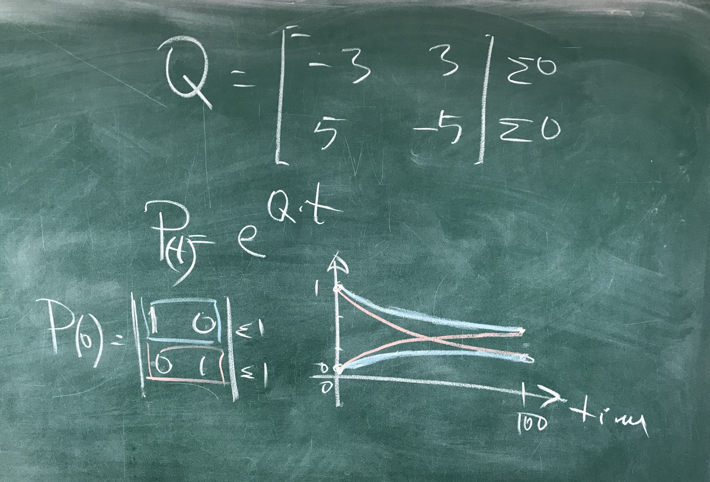

# Welcome to my report of my international semester in riga
# Course : Telecommunications

This git is a recap of all achieved tasks during this semester  
This github page README project fie can be accessed <a href="githubpage">here</a>.  
 
* * *

# Week Recap

### Week 1

Introduction to UNIX SHELL  

### Week 2

Discovering more UNIX commands  
 
Homework : elemantary statistics  
Find the data vector of a given figure  
Result can be found <a href="img/PlotWeek2.pdf">here</a>.  

### Week 3

More UNIX commands  
Some IPV4 related problem solving  
Establishing ssh connections  

### Week 4

Refresh on already seen subjects  
Learning UNIX SHELL, BASH, R and PYTHON  
Homework : <a href="#ping1">AWK scripts</a>  
Using UNIX commands, write script in BASH using AWK to gather statistical data of RTT of given HOST

### Week 5

Discovering Jupyter Notebook(cloud editors / computation)  
Learning to use BASH, R and Python in Jupyter  
Creating graphs in R and Python  

### Week 6

Installing Java and discovering basic syntax  
 
Midterm exam : individual report  
Given a graph [here](http://213.175.92.37:3104)(randomly generated), recreate as close as possible graph in R and Python  and make report using Mardown in Jupyter and LateX to PDf conversion  
Result can be found <a href="img/PlotMidterm.pdf">here</a>.  
 
MicroProject in R, Python and Octave : <a href="#microproject1">expm graph (microproject 1)</a>  
visualize expm results of given matrix [[-3, 3], [5, -5]] in graphs and save results to image format (png, jpg) and pdf  
Result can be found <a href="img/ReportMicroproject.pdf">here</a>.  

### Week 7

Discovering AWS cloud, manipulating files and python/bash scripts

### Week 11

Project : <a href="#ping2">411-MTP</a>  
combine google colab and bash : ping 5 hosts and collect 100 pings with 3 sec interval  
load data in python panda data frame and restrieve average, standard dev, variance, histograms, boxplots  

### Week 13

Wireshark and networking data packet retrieving with tcpdump  
Project : <a href="#tcpdump1">tcpdump</a>  
load 100 rtt data using tcpdump and present them in matplotlib using logarithmic scale  

### Week 14

Project : <a href="#web1">Computing distribution over the cloud</a>  
Matrix to multiplicate : send matrix + 1 column of second matrix to each client  
Each client do multiplication and send back data  
Server gather data, puts together and show result  

### Week 15

Project : <a href="#githubpage1">Github pages</a>  
creating a github page to showcase our projects on github  
An alternative (completly done by hand and by me) can be found <a href="githupage/html/">here</a>.

### Week 16

Analysing network and finding malware or hacker connections.  
 
 
 
 
 
* * *

# Projects links

## Ping & AWK : gather RTT of ping and re-calculate statistics

#### Description :

> See [README of project here](PingAwk).
Click on image to access git page.

 

 
 
## MicroProject : R, Python and Octave expm graph

#### Description : 

> See [README of project here](411-microproject).

Click on image to access git page.

 

 
 
## Ping country analyser : 411-MTP

#### Description : 

> See [README of project here](411-MTP).

Click on image to access git page.

 

 
 
## Expm : show graph of expm of given graph

#### Description : 

> See [README of project here](exmp-graph).

Click on image to access git page.

 

 
 
## TCPdump : 

#### Description : 

> See [README of project here](tcpdump)

Click on image to access git page.

 

 
 
## Python server : Cloud computing

#### Description : 

> See [README of project here](411W14)

Click on image to access git page.

 

 
 
## Github Page : Website

#### Description : 

> See [README of project here](githubpage)

Click on image to access git page

 
 
 
 
* * *

# Personal Projects:

## Website : PHP Project

#### Description : 

A website using HTML / CSS / PHP / MySql / Javascript / Jquery / AJAX and w3css bootstrap  
Website was dedicated to present a Unity 3D game i participated to develop  
Click on image to access git page  
 

 
 
## Unity game : Hello World!

#### Description : 

A unity 3D game inspired of Plague inc but in 3D  
Click on image to access git page  
 

 
 
## C low level : printf with syscalls and malloc libraries

#### Description : 

Recoding printf implementation using syscalls, malloc and variadic libraries only  
Click on image to access git page  
 

 
 
## C : character recognition

#### Description : 

C program using GTK and glade for GUI  
Neural Network with fast convergence to be font-more precise and fast-learning  
Program input is clear image white/black with no overlapping lines  
Click on image to access git page  
 

